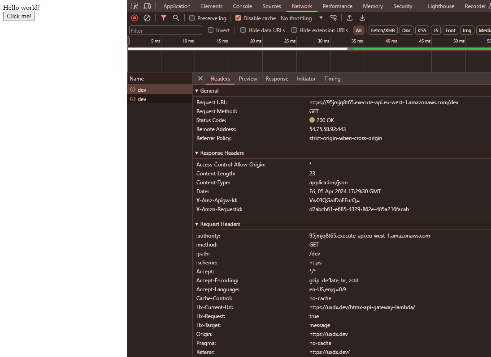

# HTML API Gateway Lambda

This shows a very simple example of sending a GET request using HTMX to a GET API Gateway endpoint that returns some `text/html` content. The `
` element is then replace with the content returned from the API Gateway endpoint.

### API Gateway endpoint information

- You must enable CORS for the endpoint and set the `Access-Control-Allow-Origin` ot `*` or the origin of the server you are sending the request from